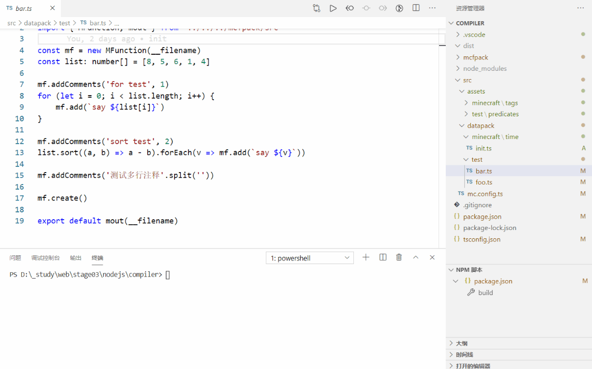

## mfcpack

mfcpack is a packer that can compile TS files into mcfunction files for minecraft. 



## install
Install with npm:

```
npm install --save-dev mfcpack
```

Install with yarn:
```
yarn add mfcpack --dev
```

## Introduction

mfcpack is a packer that can compile TS files into mcfunction files for minecraft. Its main purpose is to convert JavaScript files into mcfunction files and output any static resources or assets. This doesn't mean it's a compiler, it's just converting JavaScript output into mcfunction files

### Get started

Make sure your file directory like this

```
| /
|-src
     |-datapack/   -> convert .ts into .mcfunction 
     |-assets/     -> copy files
```

### other
Also, you can clone this repository.


